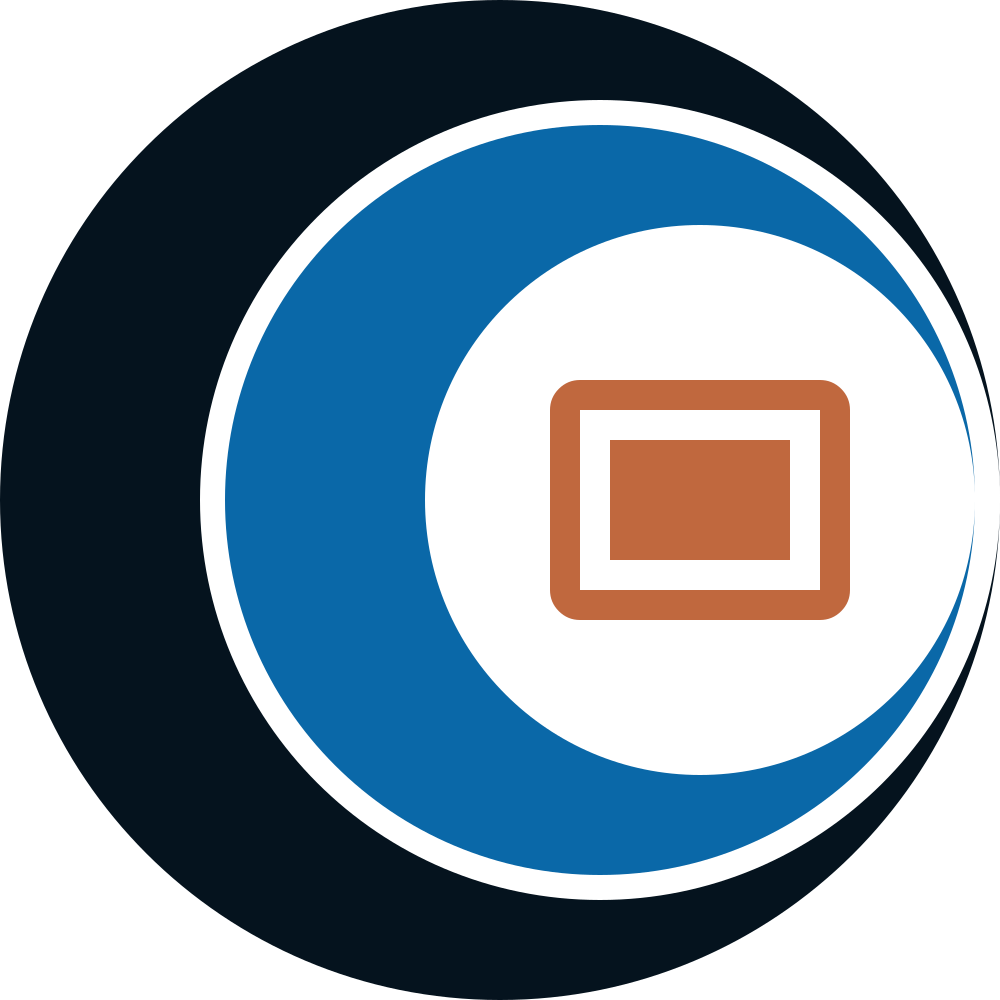
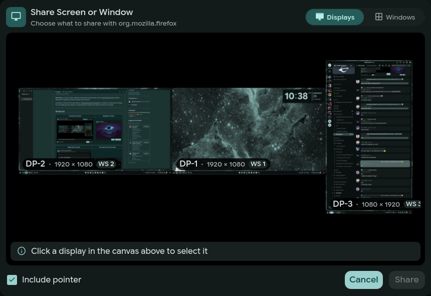
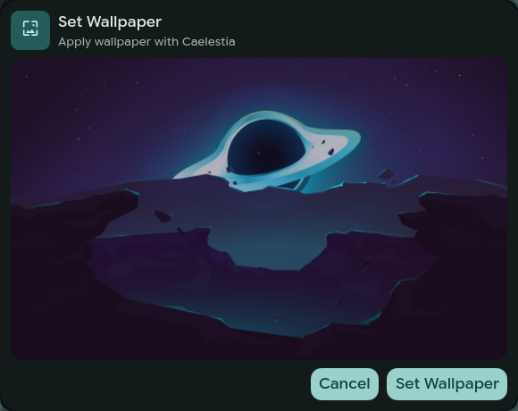
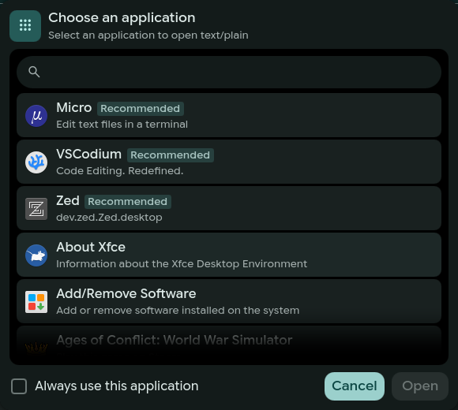
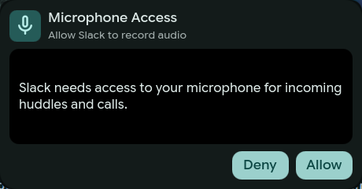
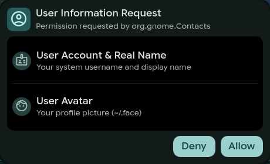
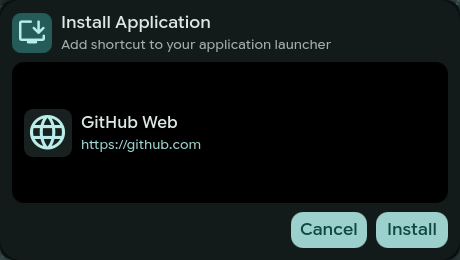

<p align="center">
  
</p>

<h1 align="center">Wormhole</h1>

**Wormhole** is a native, modern, Material 3 Expressive implementation of the `xdg-desktop-portal` backend designed for Wayland & Hyprland desktop environments.

It provides a unified D-Bus portal daemon (`xdg-desktop-portal-wormhole`) and Material 3 Expressive UI dialogs for all 24 desktop portal interfaces, integrating with Caelestia shell styling and Atlas file manager.

---

## Showcase

| ScreenCast Chooser | Wallpaper Preview |
| :---: | :---: |
|  |  |

| Application Chooser | Permission Access Prompt |
| :---: | :---: |
|  |  |

| User Account Modal | Dynamic Launcher |
| :---: | :---: |
|  |  |

---

## Features

- **ScreenCast & Screen Sharing (`org.freedesktop.impl.portal.ScreenCast`)**:
  - Material 3 Expressive dialog for sharing displays or individual application windows.
  - Hyprland IPC integration for live monitor and window discovery with application icons and workspace tags.
  - PipeWire stream node generation with hardware-accelerated / Wayland screencopy capture.
  - Persistent restore token support and cursor visibility toggles (embedded, hidden, metadata).
- **Screenshot & Color Picker (`org.freedesktop.impl.portal.Screenshot`)**:
  - Interactive region crop selector with live dimensions and magnifier.
  - Window and fullscreen snapshot modes.
  - Precision pixel color picker tool (`PickColor`).
- **FileChooser Portal (`org.freedesktop.impl.portal.FileChooser`)**:
  - Seamless delegation to `atlas --picker` for Material 3 file and folder selection, saving, and multi-file handling.
- **Application Chooser (`org.freedesktop.impl.portal.AppChooser`)**:
  - Searchable Material 3 app chooser filtering system desktop entries by MIME type or URL protocol scheme.
- **Access & Permissions (`org.freedesktop.impl.portal.Access`)**:
  - Material 3 security permission prompt with `SmartIcon` mapping for microphone, camera, and device permissions.
- **Dynamic Launcher (`org.freedesktop.impl.portal.DynamicLauncher`)**:
  - Web application and desktop shortcut installer.
- **Wallpaper (`org.freedesktop.impl.portal.Wallpaper`)**:
  - Wallpaper preview and target selection with Caelestia integration.
- **Settings (`org.freedesktop.impl.portal.Settings`)**:
  - Appearance and theme settings provider (`color-scheme`, `accent-color`, `contrast`).
- **Notifications & Inhibit (`org.freedesktop.impl.portal.Notification`, `org.freedesktop.impl.portal.Inhibit`)**:
  - Notification dispatching, action handling, and sleep/idle/notification inhibition tracking.
- **Complete Portal Suite Support**:
  - `GlobalShortcuts`, `Secret` (deterministic app-derived master keys), `Email`, `Print`, `Background`, `Realtime`, `Camera`, `Lockdown`, `RemoteDesktop`, `InputCapture`, `Location`, `Usb`, and `Clipboard`.

---

## Build & Installation

### Requirements
- **C++20** compiler
- **CMake** ≥ 3.19
- **Qt 6.5+** (`Core`, `Gui`, `Qml`, `Quick`, `QuickControls2`, `QuickEffects`, `DBus`, `Concurrent`, `Svg`, `Network`)
- **PipeWire** (`libpipewire-0.3`)
- **Wayland Client** (`wayland-client`)
- **Wayland Protocols** (`wayland-protocols` ≥ 1.38) and `wayland-scanner`
- **Atlas** (runtime dependency for file choosing)

Screen capture uses `ext-image-copy-capture-v1`, so the compositor has to
implement it along with `ext-image-capture-source-v1`. Window capture
additionally needs `ext-foreign-toplevel-list-v1`. Hyprland supports all three
since 0.47, Sway since 1.11.

### Build Commands
```bash
cmake -B build -S . -DCMAKE_INSTALL_PREFIX=/usr
cmake --build build -j$(nproc)
sudo cmake --install build
```

---

## Usage

### Selecting Wormhole as the portal backend

`xdg-desktop-portal` picks a backend per interface. Most wlroots backends ship
their own preference file in `/usr/share/xdg-desktop-portal`, for example
`hyprland-portals.conf` from `xdg-desktop-portal-hyprland`, and a file matching
`$XDG_CURRENT_DESKTOP` wins over the `UseIn` line in `wormhole.portal`. So on a
Hyprland or Sway session with one of those backends installed, Wormhole is not
used until it is asked for explicitly:

```bash
mkdir -p ~/.config/xdg-desktop-portal
cp /usr/share/xdg-desktop-portal/wormhole-portals.conf ~/.config/xdg-desktop-portal/portals.conf
systemctl --user restart xdg-desktop-portal.service
```

To hand only screen sharing to Wormhole and leave the rest alone:

```ini
[preferred]
default=hyprland;gtk
org.freedesktop.impl.portal.ScreenCast=wormhole
```

`/usr/share/xdg-desktop-portal/portals` must contain `wormhole.portal` for any
of this to resolve.

### Run as D-Bus Portal Daemon
```bash
wormhole --daemon
```

### Direct CLI Dialog Testing
```bash
# Screen share chooser
wormhole --screencast --app-id "org.mozilla.firefox" --types 3 --multiple

# Interactive screenshot
wormhole --screenshot --interactive

# Color picker
wormhole --pick-color

# Application chooser
wormhole --appchooser --mime "image/png"

# Access permission prompt
wormhole --access --title "Camera Permission" --app-id "org.mozilla.Firefox" --icon "camera-web"

# Dynamic launcher prompt
wormhole --dynamic-launcher --name "GitHub" --url "https://github.com"

# Wallpaper preview
wormhole --wallpaper --url "file:///usr/share/backgrounds/default.png"
```

---

## License
GPL-3.0 License.
